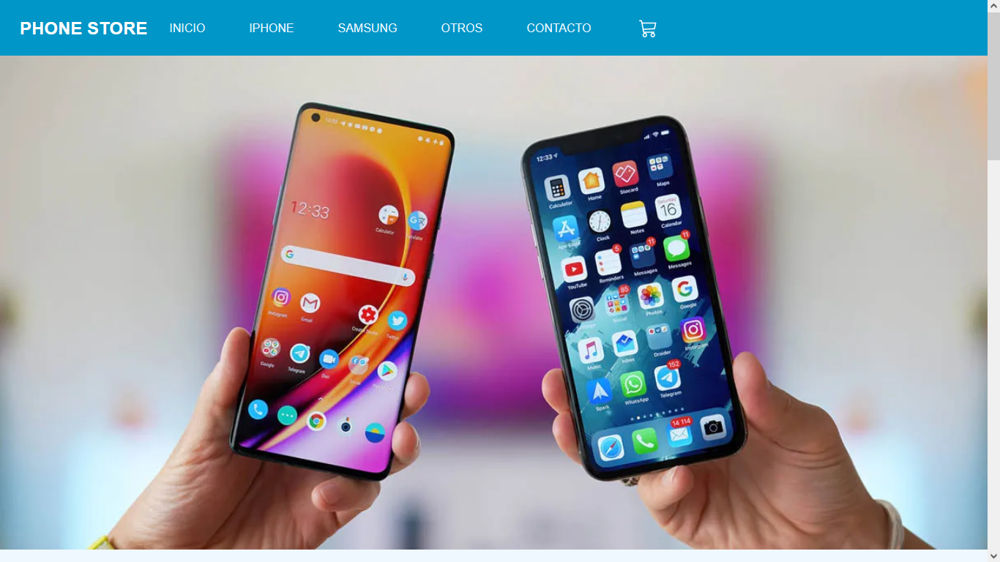
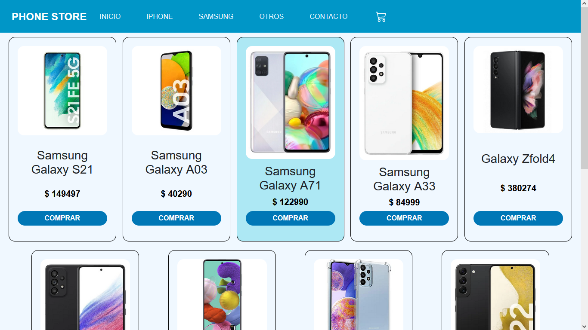

# Ecommer con ReactJs/Tienda de Telefonos.
Es un sitio web que lo realize en mi curso de reactJs, donde podes comprar dispositivos de distintas marcas, te muestra categorias de teléfonos Iphone, Samsung y otros, agregas al carrito y simula tu compra al bajar el stock de dicho producto, ya que los datos son traidos de firestore (que simula ser una base de datos), asi se trabajaria en un proyecto real donde los datos nos vienen del back-end.





## Comenzando 🚀
Para obtener una copia funcional del proyecto debes tener Node js, lo cual podes descargarlo de internet e instalarlo en tu computadora.
Luego vas al repositorio del proyecto y haces click en "code" copias el link y en donde tenes tus trabajos creas una carpeta nueva (nombre que deseas), lo abris con git ejecutando los siguientes comandos.

### Pre-requisitos 📋
Recuerda tener instalado [Node.js](https://nodejs.org/es/).

## Instalación 🔧
Una vez abierto la terminal del git ejecutas el comando.

```git clone "link del repositorio copiado"```

Una vez completado la clonación abri el archivo con tu editor de código favorito, recomiendo(Visual Studio Code).
En tu editor debes instalar las dependencias del mismo, para eso vas abrir la terminal del VSC y ejecutas el siguiente comando.

```npm install```

Vas a tener que ser paciente ya que esto puede llevar unos minutos, mientras se instala te explico lo que hace este comando.Permite agregar todas las extensiones y archivos necesarios como los node_modules, que contiene archivos importante para la ejecucion del programa, los mismos no se suben a GitHub debido a la gran cantidad de memoria que ocupan.
A continuacion ejecutas el siguiente comando.

```npm start```

Esto perimite que puedas visualizar el sitio web en tu navegador.

## Previsualización del sitio.
Si queres saber como se veria el sitio web en tu dispositivo, [click](https://ecommer-phone-store.netlify.app/) aquí.
Esta subido a netlify y podrás interactuar con ella.
## Construido con 🛠️
Este proyecto fue creado con:
* HTML.
* CSS.
* JavaScript.
* [Node.js](https://nodejs.org/es/) -version 16.15.1.
* [Firebase](https://firebase.google.com/?hl=es)
* [React](https://es.reactjs.org/).
* [Bootstrap](https://getbootstrap.com/docs/5.2/getting-started/introduction/).

## 💫💕 CODE BY Agustina E. Cobas, 44486820 💕💫
